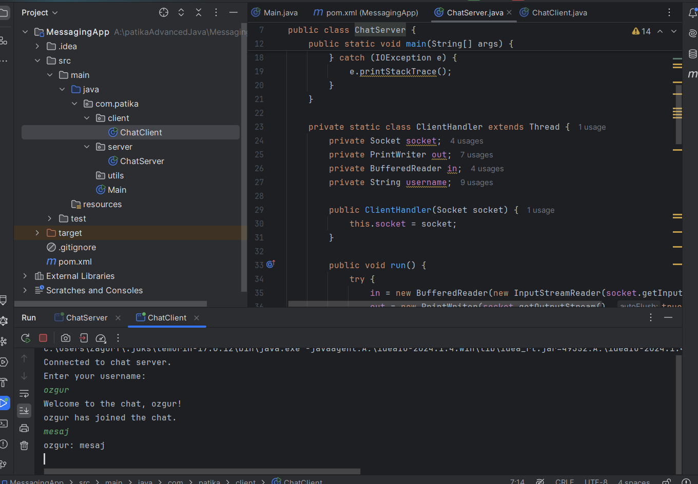

## Client-Server Messaging App



## Project Structure

```
ChatApp/
├── src/
│   ├── server/
│   │   ├── ChatServer.java
│   ├── client/
│   │   ├── ChatClient.java
│   └── utils/
│       ├── ClientHandler.java
│       ├── Message.java
├── README.md
└── pom.xml
ChatApp/
├── src/
│   ├── server/
│   │   ├── ChatServer.java
│   ├── client/
│   │   ├── ChatClient.java
│   └── utils/
│       ├── ClientHandler.java
│       ├── Message.java
├── README.md
└── pom.xml
```